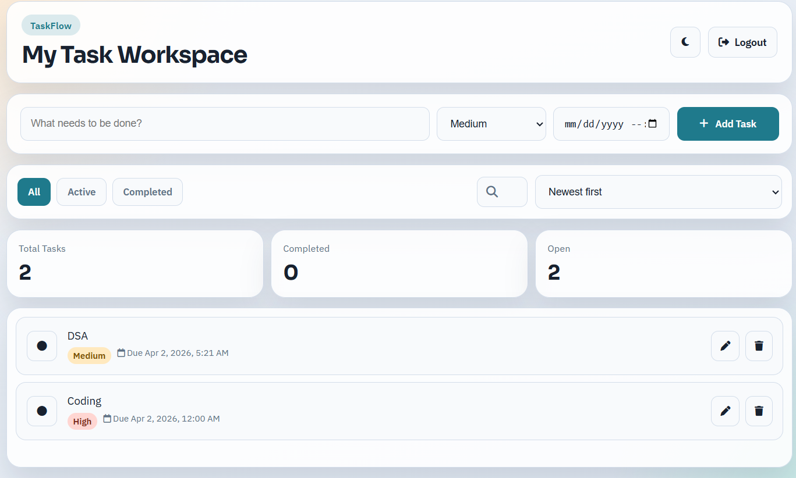
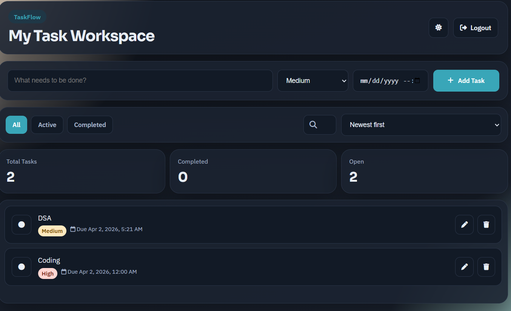

# TaskFlow

TaskFlow is a modern full-stack to-do application built with Flask, SQLite, and vanilla JavaScript. It includes secure authentication, dynamic task management, and a clean responsive UI designed for everyday productivity.

## Screenshots

Add your screenshots in GitHub later by replacing these image paths.




## Features

- User registration and login
- Session-based authentication
- Secure password hashing with `werkzeug.security`
- Create, edit, delete, and complete tasks
- Task priority support: Low, Medium, High
- Due date and time support
- Real-time search and task filtering
- Sorting by newest, due date/time, and priority
- Task counters: Total, Completed, Open
- Dark mode toggle with saved preference
- Empty-state UI for new users
- Fully responsive layout (desktop and mobile)

## Tech Stack

- Backend: Flask (Python)
- Database: SQLite
- Frontend: HTML, CSS, Vanilla JavaScript
- Icons: Font Awesome

## Project Structure

```text
todo/
|-- app.py
|-- database.db
|-- requirements.txt
|-- README.md
|-- static/
|   |-- app.js
|   `-- style.css
`-- templates/
    |-- dashboard.html
    |-- login.html
    `-- register.html
```

## Getting Started

### 1. Clone the repository

```bash
git clone <your-repo-url>
cd todo
```

### 2. Create and activate virtual environment

Windows (PowerShell):

```powershell
python -m venv .venv
.\.venv\Scripts\Activate.ps1
```

### 3. Install dependencies

```bash
pip install -r requirements.txt
```

### 4. Run the app

```bash
python app.py
```

Open: `http://127.0.0.1:5000`

## API Endpoints

- `GET /tasks` - Fetch all tasks for the logged-in user
- `POST /tasks` - Create a new task
- `PUT /tasks/<id>` - Update an existing task
- `DELETE /tasks/<id>` - Delete a task

## Security Notes

- Passwords are hashed (not stored in plain text)
- Task APIs are protected by session authentication
- User-level task ownership checks are enforced on updates/deletes

## Next Improvements

- CSRF protection for form/API operations
- Pagination for large task lists
- Unit tests for API and authentication flows